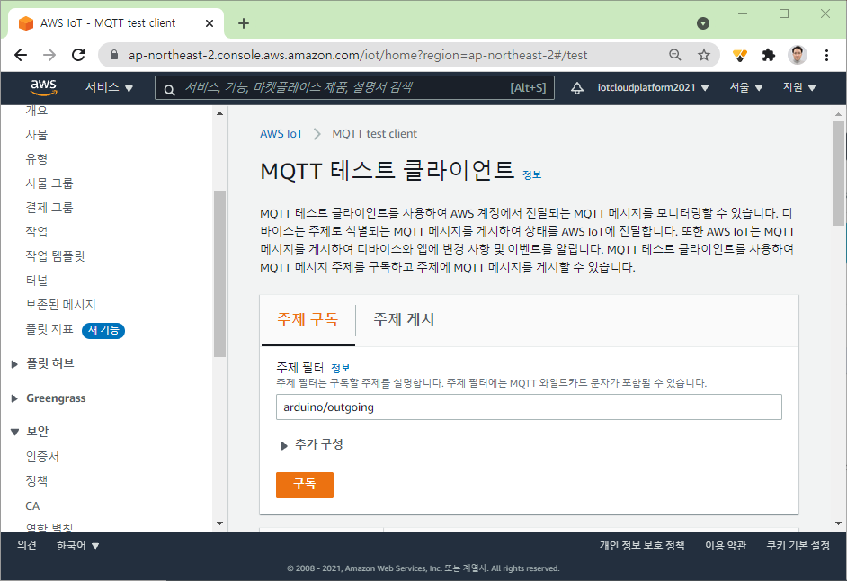
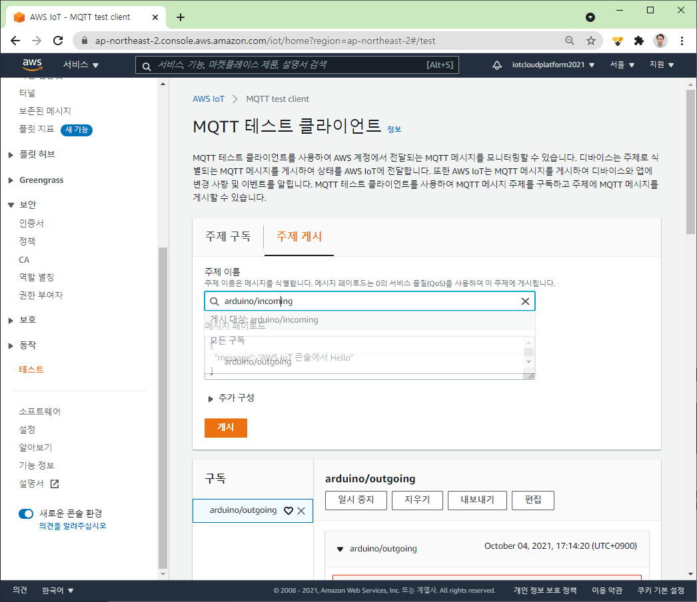
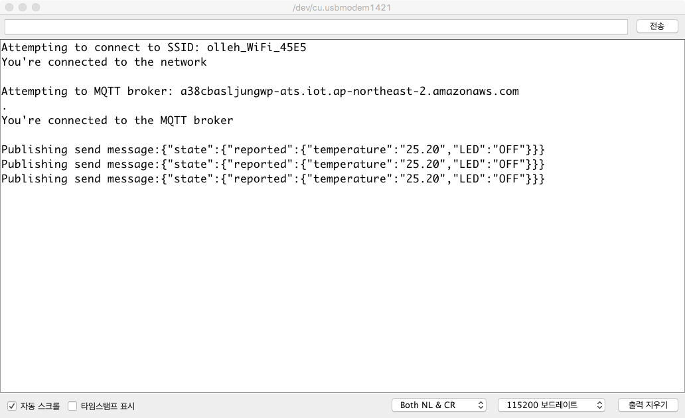
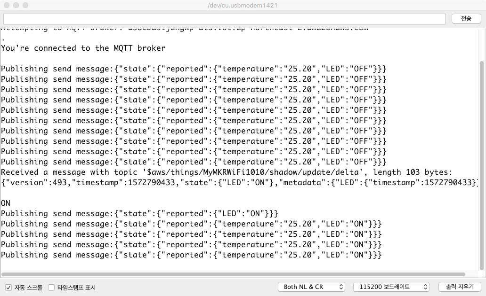

# AWS IoT 시작하기 (아두이노 연결)

##  준비사항
- [LED와 DHT-11 센서를 포함한 MKR WiFi 1010 보드 설정하기](arduino-setting.html)
- 유효한 AWS 계정

---
<a name="1"></a>
## 1. 개요
- 다음과 같이 동작하는 IoT 서비스를 AWS 서비스를 이용하여 구축해 본다.

	- LED와 온습도 센서(DHT-11)를 장착한 아두이노 보드(MKR WiFi1010)를 AWS IoT와 연결
	- 아두이노 보드에서는 AWS IoT와 인증과정을 거친후, 온습도 센서에서 측정된 온습도 값을 매 5초마다 AWS IoT로 전송
	- 외부 MQTT Client를 통해서 아두이노 보드의 LED를 제어

<!--
- AWS IoT는 수집된 온도가 25도를 넘어갈 경우, SNS를 통해 경고 이메일을 전송하고 아두이노 보드의 LED를 ON 시키고, 25도 미만으로 떨어지면, 아두이노 보드의 LED를 다시 OFF 상태로 만듦
-->
- **IoT 서비스 아키텍처**
	

- **주요 학습내용**
	- [AWS IoT Core와 아두이노 (MKR WiFi 1010) 연결하기[실습]](#2)
	- [AWS IoT로 온도 값 전송 및 LED 제어[실습]](#3)

---
<a name="2"></a>
## 2. AWS IoT Core와 아두이노 (MKR WiFi 1010) 연결하기
### 2.1 관련 라이브러리 설치
1. **Arduino IDE**의 **스케치-라이브러리 포함하기-라이브러리 관리** 메뉴 클릭
2. 검색 창에서 다음 5가지 라이브러리를 검색하여 설치
	- WiFiNINA (or WiFi101 for the MKR1000)
	- ArduinoBearSSL
	- ArduinoECCX08
	- ArduinoMqttClient
	- Arduino Cloud Provider Examples

### 2.2 AWS IoT 정책 생성
- **AWS IoT 정책**은 디바이스가 **MQTT 주제 구독 또는 게시와 같은 AWS IoT 작업을 수행할 수 있는 권한을 부여**하는 데 사용합니다.
- **디바이스가 AWS IoT 작업을 수행하도록 허용하려면 AWS IoT 정책을 생성하여 디바이스 인증서에 연결**해야 합니다.
- **AWS IoT 정책을 생성하려면**
	1. 왼쪽 탐색 창에서 **보안**을 선택하고 **정책**을 선택합니다.
	2. **정첵** 페이지에서 [**생성**]를 선택합니다.
	3. **정책 생성** 페이지의 **이름** 필드에 정책 이름(예: *AllowEverything*)을 입력합니다.
		- **작업** 필드에 *iot:**를 입력합니다.
		- **리소스 ARN 필드**에 *를 입력합니다.
		- [**허용**] 확인란을 선택합니다.
		- **생성**을 클릭합니다.

### 2.3 AWS IoT Core에 아두이노 보드를 연결하기 위한 설정
- AWS IoT Core는 X.509 인증서를 사용하여 디바이스를 인증함.
- X.509 인증서를 생성하기 위해서, 아두이노 보드에서 CSR(Certificate Signing Request)를 생성한후, 이를 AWS 콘솔에서 업로드할 것이다.
	- CSR 생성 절차
		1. MKR WiFi 1010 보드를 USB 케이블로 컴퓨터와 연결
		2. **Arduino IDE**의 **파일-예제-ArduinoECCX08-Tools-ECCX08CSR** 메뉴 선텍
		3. 프로그램을 보드에 업로드 시킨다.
		3. 시리얼 모니터 창을 연다. (줄 마침 설정은 "**Both NL & CR**"로 되어 있어야 함)
		4. 시리얼 모니터 창에서 CSR에 포함될 정보를 입력하는데, 아래 그림과 같이 **Common Name** 을 제외하곤 모두 빈칸을 입력 (아무 입력없이 **전송** 버튼을 누름)
			- **Common Name**: *MyMKRWiFi1010* 입력
			- **Would you like to generate...?"** 질문에 *Y*를 입력한다.

			
		5. "-----BEGIN CERTIFICATE REQUEST-----" 과 "-----END CERTIFICATE REQUEST-----" 사이에 생성된 CSR 문자열을 복사하여 텍스트 에디터에 붙여넣기 한 후, **csr.txt** 파일로 저장한다.
			- 이 파일은 후에 AWS 콘솔에서 X.509 인증서 생성을 위해 업로드 됨

			- csr.txt 예시

				

### 2.4 레지스트리에 디바이스 등록
1. AWS Management Console에 로그인하고 [AWS IoT 콘솔](https://console.aws.amazon.com/iot/home)을 엽니다.
2. 왼쪽 탐색 창에서 **관리 > 사물**을 선택합니다.
3. **사물** 페이지에서 **사물 생성**을 클릭합니다.
4. **사물 생성** 페이지에서 **단일 사물 생성**을 선택하고, **다음**을 클릭합니다.
5. **사물 속성 지정** 페이지의 **사물 이름** 필드에 *MyMKRWiFi1010*과 같은 사물의 이름을 입력합니다.
6. **디바이스 섀도우** 에서 **이름 없는 섀도우(클래식)**을 선택한 후에 **다음**을  클릭합니다.
6. **디바이스 인증서 구성** 페이지에서 **CSR 업로드**를 선택합니다.
	- **파일 선택**를 클릭한 후 앞서 생성한 CSR 파일 (csr.txt)을 열고, **다음**을 클릭합니다.
7. 다음 화면에서 앞서 생성한 정책(*AllowEverything*)을 선택하고, **사물 생성**을 클릭합니다.
8. 이제 여러분은 **사물** 페이지에서 새롭게 등록된 사물을 확인할 수 있습니다.


<a name="2.5"></a>
### 2.5 디바이스 구성
- 모든 디바이스에는 AWS IoT와 통신할 수 있도록 디바이스 인증서가 설치되어 있어야 합니다.
	1. 왼쪽 탐색 창에서 **보안**을 선택하고 **인증서**를 선택합니다.
	2. 앞서 생성한 인증서의 상자에서 ...를 선택해 드롭다운 메뉴를 연 다음 **활성화**를 선택한 후에, [**다운로드**]를 선택합니다.
	3. 다운로드된 인증서(*xxxxxxxxxx-certificate.perm.crt*)를 확인합니다.
	4. 왼쪽 탐색 창에서 **설정**을 선택하고, **엔드포인트**를 기억해 둡니다.
	4. **Arduino IDE**의 **파일-예제-Arduino Cloud Provider Examples-AWSIoT-AWS\_IoT\_WiFi** 메뉴 선텍
		- arduino_secrets.h 탭에서, 사용가능한 WiFi의 SSID와 Password를 설정

			```c
			// Fill in  your WiFi networks SSID and password
			#define SECRET_SSID ""
			#define SECRET_PASS ""
			```
		- 앞에서 확인한 **엔드포인트**를 **SECRET\_BROKER** 값으로 설정

			```c
			// Fill in the hostname of your AWS IoT broker
			#define SECRET_BROKER "xxxxxxxxxxxxxx.iot.xx-xxxx-x.amazonaws.com"
			```
		- 앞에서 다운로드한 인증서 파일을 텍스트 에디터로 열고 값을 복사하여 다음 영역에 붙여넣기 한다.

			```c
			// Fill in the boards public certificate
			const char SECRET_CERTIFICATE[] = R"(
			-----BEGIN CERTIFICATE-----
			-----END CERTIFICATE-----
			)";
			```

---
### 2.7 테스트
1. 스케치 프로그램을 보드에 업로드하고, 시리얼 모니터 창을 연다.
	- 보드는 WiFi 네트워크와 연결을 시도하고, 성공하면 AWS IoT에 MQTT를 통해 연결을 시도한다.

		

2. MQTT Client를 통해 AWS IoT Core와 디바이스 간의 상호작용을 모니터링 한다.
	- 디바이스의 스케치 프로그램은 **arduino/outgoing** 토픽으로 매 5초마다 메시지를 AWS IoT Core로 보내고, **arduino/incoming** 토픽에 대한 메시지를 기다린다.
	- **디바이스에서 AWS IoT로의 상호작용 모니터링**
		1. **AWS IoT Core 콘솔**의 **테스트** 메뉴를 클릭
		2. **구독 주제 (Subscribe topic)** 박스에 *arduino/outgoing*을 입력하고 **구독** 버튼을 클릭한다.

			
			- 매 5초마다 보드에서 보낸 *hello* 메시지가 현재 시간정보와 함께 표시된다.
			

	- **AWS IoT에서 디바이스로의 상호작용 모니터링**
		1. **주제 게시**메뉴의 **게시**섹션에서, 게시할 주제로 *arduino/incoming*을 입력하고, **게시** 버튼을 클릭한다.

			

		2. 시리얼 모니터 창에서 메시지 수신을 확인한다.

			

<a name="3"></a>
## 3. AWS IoT로 온도 값 전송 및 LED 제어
- [2. AWS IoT Core와 아두이노 (MKR WiFi 1010) 연결하기](#2)에서 수행한 실습 설정을 바탕으로 다음 과정을 진행합니다.

- 필요한 라이브러리 설치
	1. **Arduino IDE**의 **스케치-라이브러리 포함하기-라이브러리 관리** 메뉴 클릭
	2. 검색 창에서 다음 라이브러리를 검색하여 설치
		- ArduinoJson

1. [AWS\_IoT\_DHT11](https://github.com/kwanulee/AWS_IoT_DHT11/archive/refs/heads/main.zip)을 다운로드하여 Arduino IDE에서 실행한다.
2. arduino_secrets.h에서 다음 항목을 사용 환경에 맞도록 수정후, 빌드/업로드 한다.
	- SECRET\_SSID: 무선랜 아이디
	- SECRET\_PASS: 무선랜 패스워드
	- SECRET\_BROKER: AWS IoT broker 엔드포인트
	- SECRET\_CERTIFICATE: 인증서 ([2.5절](#2.5) 참조)
3.  아두이노 IDE의 시리얼 모니터를 열고, 접속이 제대로 이루어지는 지 확인해 본다.
	
4. **AWS IoT MQTT Client**를 통해 다음 주제를 구독하여, 현재 디바이스 상태 업데이트가 제대로 수신되는 지를 확인한다.
	- 주제: $aws/things/MyMKRWiFi1010/shadow/update

	

	- 다음 주제를 추가로 구독하여, 디바이스 섀도우 서비스로부터의 응답을 확인해 본다.
		- $aws/things/MyMKRWiFi1010/shadow/update/accepted
		- $aws/things/MyMKRWiFi1010/shadow/update/documents  

4. **AWS IoT MQTT Client**를 통해 다음 주제와 메시지를 지정하여 게시하여, 아두이노의 LED가 켜지는지 확인한다.
	- 주제 : **$aws/things/MyMKRWiFi1010/shadow/update**
	- 메시지

		```json
		{
		  "state": {
		      "desired": {
		          "LED": "ON"
		      }
		  }
		}
		```
	- 결과 (시리얼 모니터창)
		- 디바이스 섀도우 서비스가 **/update** 요청에 대해 응답하는 **$aws/things/MyMKRWiFi1010/shadow/update/delta** 주제의 메시지를 게시하는데, 아두이노 디바이스에서는 **$aws/things/MyMKRWiFi1010/shadow/update/delta** 주제를 구독하고 있으므로, 아래와 같이 수신된 **update/delta** 메시지를 처리하고 있습니다.   

		
